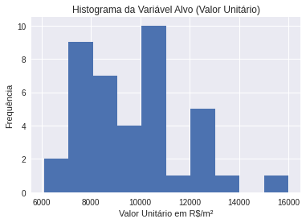
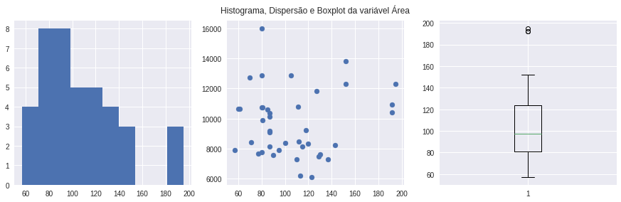
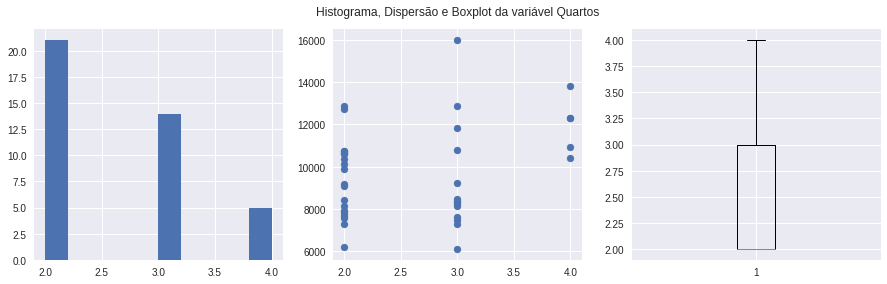
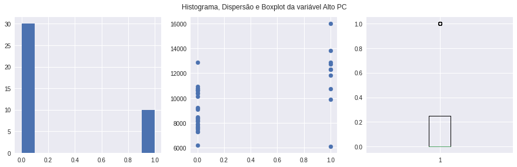
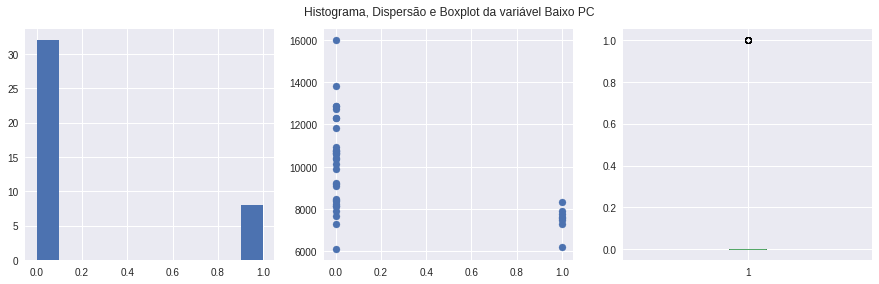
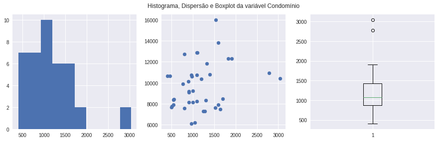

### Importações


```python
import pandas as pd
import numpy as np
import statsmodels.api as sm
import matplotlib.pyplot as plt
plt.style.use('seaborn')
%matplotlib inline
```

### Carregamento dos Dados da Amostra


```python
df = pd.read_csv("../dados/amostra.csv")
```


```python
df.head()
```


<div>
<style scoped>
    .dataframe tbody tr th:only-of-type {
        vertical-align: middle;
    }

    .dataframe tbody tr th {
        vertical-align: top;
    }

    .dataframe thead th {
        text-align: right;
    }
</style>
<table border="1" class="dataframe">
  <thead>
    <tr style="text-align: right;">
      <th></th>
      <th>Endereço</th>
      <th>Bairro</th>
      <th>VT</th>
      <th>Área</th>
      <th>Vap</th>
      <th>Quartos</th>
      <th>Banheiros</th>
      <th>Vagas</th>
      <th>Alto PC</th>
      <th>Baixo PC</th>
      <th>Varanda</th>
      <th>Fundos</th>
      <th>Dependências</th>
      <th>Condomínio</th>
      <th>Pavimento</th>
      <th>VU</th>
      <th>Fonte</th>
      <th>Imobiliária</th>
      <th>Atualizado</th>
      <th>Link</th>
    </tr>
  </thead>
  <tbody>
    <tr>
      <th>0</th>
      <td>Rua Ererê</td>
      <td>Cosme Velho</td>
      <td>1000000</td>
      <td>120</td>
      <td>3771.38</td>
      <td>3</td>
      <td>3</td>
      <td>3</td>
      <td>0</td>
      <td>1</td>
      <td>1</td>
      <td>1</td>
      <td>1</td>
      <td>1308</td>
      <td>NaN</td>
      <td>8333.333333</td>
      <td>Zap</td>
      <td>Kasanova</td>
      <td>01/11/2021</td>
      <td>https://www.zapimoveis.com.br/imovel/venda-apa...</td>
    </tr>
    <tr>
      <th>1</th>
      <td>Rua Filinto de Almeida</td>
      <td>Cosme Velho</td>
      <td>700000</td>
      <td>113</td>
      <td>3295.39</td>
      <td>2</td>
      <td>2</td>
      <td>0</td>
      <td>0</td>
      <td>1</td>
      <td>1</td>
      <td>1</td>
      <td>1</td>
      <td>1044</td>
      <td>1.0</td>
      <td>6194.690265</td>
      <td>Zap</td>
      <td>OrlaRio</td>
      <td>01/11/2021</td>
      <td>https://www.zapimoveis.com.br/imovel/venda-apa...</td>
    </tr>
    <tr>
      <th>2</th>
      <td>Praça São Judas Tadeu, 6</td>
      <td>Cosme Velho</td>
      <td>965000</td>
      <td>129</td>
      <td>3771.38</td>
      <td>3</td>
      <td>4</td>
      <td>2</td>
      <td>0</td>
      <td>1</td>
      <td>1</td>
      <td>1</td>
      <td>1</td>
      <td>1640</td>
      <td>NaN</td>
      <td>7480.620155</td>
      <td>Zap</td>
      <td>João Correa</td>
      <td>01/11/2021</td>
      <td>https://www.zapimoveis.com.br/imovel/venda-apa...</td>
    </tr>
    <tr>
      <th>3</th>
      <td>Rua Cosme Velho, 315</td>
      <td>Cosme Velho</td>
      <td>880000</td>
      <td>87</td>
      <td>3795.13</td>
      <td>2</td>
      <td>2</td>
      <td>1</td>
      <td>0</td>
      <td>0</td>
      <td>0</td>
      <td>0</td>
      <td>1</td>
      <td>900</td>
      <td>NaN</td>
      <td>10114.942529</td>
      <td>Zap</td>
      <td>Calleri</td>
      <td>NaN</td>
      <td>https://www.zapimoveis.com.br/imovel/venda-apa...</td>
    </tr>
    <tr>
      <th>4</th>
      <td>Rua Marechal Pires Ferreira</td>
      <td>Cosme Velho</td>
      <td>1870000</td>
      <td>152</td>
      <td>3980.89</td>
      <td>4</td>
      <td>3</td>
      <td>2</td>
      <td>1</td>
      <td>0</td>
      <td>1</td>
      <td>1</td>
      <td>1</td>
      <td>1826</td>
      <td>NaN</td>
      <td>12302.631579</td>
      <td>Zap</td>
      <td>Indik</td>
      <td>NaN</td>
      <td>https://www.zapimoveis.com.br/imovel/venda-apa...</td>
    </tr>
  </tbody>
</table>
</div>


### Atribuição das Variáveis Independentes (X) e Dependentes (y)


```python
X = df.iloc[:, 3:14]
X = sm.add_constant(X).dropna()
X.drop(columns=["Vap", "Banheiros", "Varanda", "Fundos", "Dependências"], inplace=True)

ind = X.index

y = df.loc[ind, 'VT'] / df.loc[ind, 'Área']

n = np.size(X, 0)
k = np.size(X, 1) - 1
```

### Análise Exploratória dos Dados


```python
X.describe()
```


<div>
<style scoped>
    .dataframe tbody tr th:only-of-type {
        vertical-align: middle;
    }

    .dataframe tbody tr th {
        vertical-align: top;
    }

    .dataframe thead th {
        text-align: right;
    }
</style>
<table border="1" class="dataframe">
  <thead>
    <tr style="text-align: right;">
      <th></th>
      <th>const</th>
      <th>Área</th>
      <th>Quartos</th>
      <th>Vagas</th>
      <th>Alto PC</th>
      <th>Baixo PC</th>
      <th>Condomínio</th>
    </tr>
  </thead>
  <tbody>
    <tr>
      <th>count</th>
      <td>40.0</td>
      <td>40.000000</td>
      <td>40.000000</td>
      <td>40.000000</td>
      <td>40.000000</td>
      <td>40.000000</td>
      <td>40.00000</td>
    </tr>
    <tr>
      <th>mean</th>
      <td>1.0</td>
      <td>106.475000</td>
      <td>2.600000</td>
      <td>1.400000</td>
      <td>0.250000</td>
      <td>0.200000</td>
      <td>1170.45000</td>
    </tr>
    <tr>
      <th>std</th>
      <td>0.0</td>
      <td>35.142922</td>
      <td>0.708918</td>
      <td>0.928191</td>
      <td>0.438529</td>
      <td>0.405096</td>
      <td>562.86433</td>
    </tr>
    <tr>
      <th>min</th>
      <td>1.0</td>
      <td>57.000000</td>
      <td>2.000000</td>
      <td>0.000000</td>
      <td>0.000000</td>
      <td>0.000000</td>
      <td>402.00000</td>
    </tr>
    <tr>
      <th>25%</th>
      <td>1.0</td>
      <td>80.750000</td>
      <td>2.000000</td>
      <td>1.000000</td>
      <td>0.000000</td>
      <td>0.000000</td>
      <td>875.00000</td>
    </tr>
    <tr>
      <th>50%</th>
      <td>1.0</td>
      <td>97.500000</td>
      <td>2.000000</td>
      <td>1.000000</td>
      <td>0.000000</td>
      <td>0.000000</td>
      <td>1072.00000</td>
    </tr>
    <tr>
      <th>75%</th>
      <td>1.0</td>
      <td>124.000000</td>
      <td>3.000000</td>
      <td>2.000000</td>
      <td>0.250000</td>
      <td>0.000000</td>
      <td>1432.00000</td>
    </tr>
    <tr>
      <th>max</th>
      <td>1.0</td>
      <td>195.000000</td>
      <td>4.000000</td>
      <td>3.000000</td>
      <td>1.000000</td>
      <td>1.000000</td>
      <td>3042.00000</td>
    </tr>
  </tbody>
</table>
</div>


```python
plt.hist(y);
plt.title("Histograma da Variável Alvo (Valor Unitário)");
plt.xlabel("Valor Unitário em R$/m²");
plt.ylabel("Frequência");
```


    

    


```python
for i in range(k):
    fig, axs = plt.subplots(1, 3, figsize=(12, 4))

    axs[0].hist(X[X.columns[i+1]])
    axs[1].scatter(X[X.columns[i+1]], y)
    axs[2].boxplot(X[X.columns[i+1]])
    
    fig.suptitle(f"Histograma, Dispersão e Boxplot da variável {X.columns[i+1]}")

    fig.subplots_adjust(left=.01, right=.99, bottom=.1, top=.9,
                        wspace=.2, hspace=.4)
```


    

    


    

    


    

    


    

    


    

    


    

    


### Dados do Imóvel Avaliando


```python
aval = [1, 100, 3, 2, 0, 0, 1340]
```

### Modelo de Regressão Linear Múltipla Não Regularizado


```python
model = sm.OLS(y, X)
results = model.fit()
results.summary()
```


<table class="simpletable">
<caption>OLS Regression Results</caption>
<tr>
  <th>Dep. Variable:</th>            <td>y</td>        <th>  R-squared:         </th> <td>   0.665</td>
</tr>
<tr>
  <th>Model:</th>                   <td>OLS</td>       <th>  Adj. R-squared:    </th> <td>   0.604</td>
</tr>
<tr>
  <th>Method:</th>             <td>Least Squares</td>  <th>  F-statistic:       </th> <td>   10.91</td>
</tr>
<tr>
  <th>Date:</th>             <td>Sat, 16 Jan 2021</td> <th>  Prob (F-statistic):</th> <td>1.11e-06</td>
</tr>
<tr>
  <th>Time:</th>                 <td>19:33:04</td>     <th>  Log-Likelihood:    </th> <td> -342.59</td>
</tr>
<tr>
  <th>No. Observations:</th>      <td>    40</td>      <th>  AIC:               </th> <td>   699.2</td>
</tr>
<tr>
  <th>Df Residuals:</th>          <td>    33</td>      <th>  BIC:               </th> <td>   711.0</td>
</tr>
<tr>
  <th>Df Model:</th>              <td>     6</td>      <th>                     </th>     <td> </td>   
</tr>
<tr>
  <th>Covariance Type:</th>      <td>nonrobust</td>    <th>                     </th>     <td> </td>   
</tr>
</table>
<table class="simpletable">
<tr>
       <td></td>         <th>coef</th>     <th>std err</th>      <th>t</th>      <th>P>|t|</th>  <th>[0.025</th>    <th>0.975]</th>  
</tr>
<tr>
  <th>const</th>      <td> 9293.4628</td> <td>  950.956</td> <td>    9.773</td> <td> 0.000</td> <td> 7358.728</td> <td> 1.12e+04</td>
</tr>
<tr>
  <th>Área</th>       <td>  -69.3888</td> <td>   17.207</td> <td>   -4.033</td> <td> 0.000</td> <td> -104.397</td> <td>  -34.380</td>
</tr>
<tr>
  <th>Quartos</th>    <td> 1741.2516</td> <td>  752.641</td> <td>    2.314</td> <td> 0.027</td> <td>  209.992</td> <td> 3272.511</td>
</tr>
<tr>
  <th>Vagas</th>      <td>  695.3719</td> <td>  418.640</td> <td>    1.661</td> <td> 0.106</td> <td> -156.358</td> <td> 1547.102</td>
</tr>
<tr>
  <th>Alto PC</th>    <td> 1720.5988</td> <td>  616.493</td> <td>    2.791</td> <td> 0.009</td> <td>  466.335</td> <td> 2974.863</td>
</tr>
<tr>
  <th>Baixo PC</th>   <td>-1689.2336</td> <td>  599.272</td> <td>   -2.819</td> <td> 0.008</td> <td>-2908.462</td> <td> -470.005</td>
</tr>
<tr>
  <th>Condomínio</th> <td>    1.8602</td> <td>    0.838</td> <td>    2.219</td> <td> 0.033</td> <td>    0.155</td> <td>    3.566</td>
</tr>
</table>
<table class="simpletable">
<tr>
  <th>Omnibus:</th>       <td> 7.778</td> <th>  Durbin-Watson:     </th> <td>   1.780</td>
</tr>
<tr>
  <th>Prob(Omnibus):</th> <td> 0.020</td> <th>  Jarque-Bera (JB):  </th> <td>   7.819</td>
</tr>
<tr>
  <th>Skew:</th>          <td>-0.636</td> <th>  Prob(JB):          </th> <td>  0.0200</td>
</tr>
<tr>
  <th>Kurtosis:</th>      <td> 4.753</td> <th>  Cond. No.          </th> <td>6.55e+03</td>
</tr>
</table><br/><br/>Notes:<br/>[1] Standard Errors assume that the covariance matrix of the errors is correctly specified.<br/>[2] The condition number is large, 6.55e+03. This might indicate that there are<br/>strong multicollinearity or other numerical problems.


```python
aval_VU = sum(results.params*aval)
aval_VT = aval_VU * aval[1]
print(f"O valor do imóvel estimado pelo Modelo de Regressão Linear Múltipla não Regularizado é de R$ {aval_VT:.2f}.")
```

    O valor do imóvel estimado pelo Modelo de Regressão Linear Múltipla não Regularizado é de R$ 1146177.03.


### Modelo de Regressão Linear Múltipla Regularizado (α = 10 para todas as variáveis explicativas)


```python
model = sm.OLS(y, X)

results_reg = model.fit_regularized(method='elastic_net', alpha=10.0, L1_wt=1.0,
                                start_params=None, profile_scale=False, refit=False)
results_reg.params
```


    const         8643.092188
    Área           -38.136472
    Quartos       1169.474306
    Vagas          659.122246
    Alto PC       1763.628702
    Baixo PC     -1731.667945
    Condomínio       0.870974
    dtype: float64


```python
aval_VU = np.dot(aval, results_reg.params)
aval_VT = aval_VU * aval[1]
print(f"O valor do imóvel estimado pelo Modelo de Regressão Linear Múltipla Regularizado por α=10 é de R$ {aval_VT:.2f}.")
```

    O valor do imóvel estimado pelo Modelo de Regressão Linear Múltipla Regularizado por α=10 é de R$ 1082321.81.


```python
SSE = np.sum((np.dot(X, results_reg.params) - y).pow(2))
SST = np.sum((np.mean(y) - y).pow(2))
R2 = 1 - SSE/SST
R2
```


    0.6237098465729364


```python
R2_Aj = 1 - (1 - R2)*((n - 1)/(n - k - 1))
R2_Aj
```


    0.5552934550407429


### Modelo de Regressão Linear Múltipla Regularizado (α proporcional ao P(t) de cada variável)


```python
alpha = [0, 0, 10, 30, 0, 0, 10]
```


```python
model = sm.OLS(y, X)

results_reg = model.fit_regularized(method='elastic_net', alpha=alpha, L1_wt=1.0,
                                start_params=None, profile_scale=False, refit=False)
results_reg.params
```


    const         8801.898697
    Área           -38.899948
    Quartos       1115.493518
    Vagas          599.961575
    Alto PC       1852.828842
    Baixo PC     -1782.580705
    Condomínio       0.992578
    dtype: float64


```python
aval_VU = np.dot(aval, results_reg.params)
aval_VT = aval_VU * aval[1]
print(f"O valor do imóvel estimado pelo Modelo de Regressão Linear Múltipla Regularizado pelo vetor α é de R$ {aval_VT:.2f}.")
```

    O valor do imóvel estimado pelo Modelo de Regressão Linear Múltipla Regularizado pelo vetor α é de R$ 1078836.24.


```python
SSE = np.sum((np.dot(X, results_reg.params) - y).pow(2))
SST = np.sum((np.mean(y) - y).pow(2))
R2 = 1 - SSE/SST
R2
```


    0.6284833473929141


```python
R2_Aj = 1 - (1 - R2)*((n - 1)/(n - k - 1))
R2_Aj
```


    0.5609348651007167


### Análise dos Modelos

#### Para y = x0 + β1x1 + ...
    OLS com todas as variáveis
        Av = 1146177.03 reais
        R² = 0.665
        Aj = 0.604

    OLS reg (α = 10) com todas as variáveis
        Av = 1082321.81 reais
        R² = 0.624
        Aj = 0.555

    OLS reg (vetor α) com todas as variáveis
        Av = 1078836.24 reais
        R² = 0.628
        Aj = 0.561
